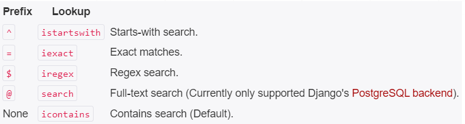

# djangoRest

# Notes
1- In validators we have 3 types of validaters:
- field level
- object level
- validator passed as an argument

2- Permission access:
- Active: Meaning that the user us authenticated and can log in to application but not admin panel.
- Staff: Meaning the user can log in to the admin panel also. 
- Superuser: Meaning that the user can do any action in the admin panel this of course can be limited through permissions.

3- Permission Combinations:
- NONE: Meaning that I have stored the user credentials but he can't neither access the application or the admin panel.
- Active only: user can login to app but not admin panel
- Staff only: User can login to admin panel.
- superuser: User can do any admin panel action
- Staff with permissions: User do only specific permision from the super user actions.

4- overriding create vs overriding perform-create:
- When you override the create method directly, you don't necessarily need to define a queryset attribute or override the get_queryset() method. This is because the create method is responsible for creating a new object, and it doesn't directly involve querying existing objects from the database.
- However, when you override the perform_create method, as you did in your original code, you still need to ensure that the queryset attribute or get_queryset() method is defined, as this method might interact with the database indirectly, such as checking for the existence of related objects or fetching related objects for validation purposes.
- In your original code, you're indirectly interacting with the database within the perform_create method by fetching the WatchList object using WatchList.objects.get(pk=pk). Therefore, Django REST Framework still expects a queryset attribute or get_queryset() method to be defined, as it needs to ensure consistency and provide flexibility for handling such cases.
- To summarize, when you override methods like perform_create or update, which might interact with the database indirectly, it's necessary to ensure that either a queryset attribute or a get_queryset() method is defined to maintain the expected behavior and to avoid errors like the one you encountered.

5- Authentication Types:
- Basic authentication
- token authentication: you can generate token automatically by either loading the models in views and get the token or use the built in get_or_create token method.

6- JWT:
Access Token and refresh token are generated automatically. 
AT is for 5 min and RT is for 24 hour. No need for a table named tokens in our database.
both tokens are stored locally on client side. 

the JWT token consists of 3 parts:
- part1: header
- part2: payload
- part3: signature which includes info about how this token is encoded

Usage:
usage is mainly through post man or terminal can't be from django admin. 

7- Throttling:
- there are authenticated and anonymous user types restrictions 
- the requests are counted together if used in general settings
- advantages of using scopedThrottle is that you don't need to write a separate python file for scoping
- and you can combine a combination such as the following: 100/day requests but maximum 1/second

8- Filtering:
- We have 3 types of filters, direct filter, searching and ordering.
- Direct filter is mainly for exact matches with keyword, while search can be more elastic depends on criteria:
- 

9- Pagination:
- Page Pagination
- Offset Limit Pagination 
- Cursor Pagination
They are all translated to limit and offset at the end.

Silk:
- Silk is one of the best tools that could be used to trace the query that hit the database. 
- Here we used select related in the foreign key to join 2 tables and avoid the n+1 queries.

10- Testing:
- Any test written should start with the keyword "test_"
- all the testcases are created in a separate database. 
- Read about Signalss!!!!

# Start From
implement the delete method for the stream platform router
16 ==> 66. API testing - ReviewTestCase